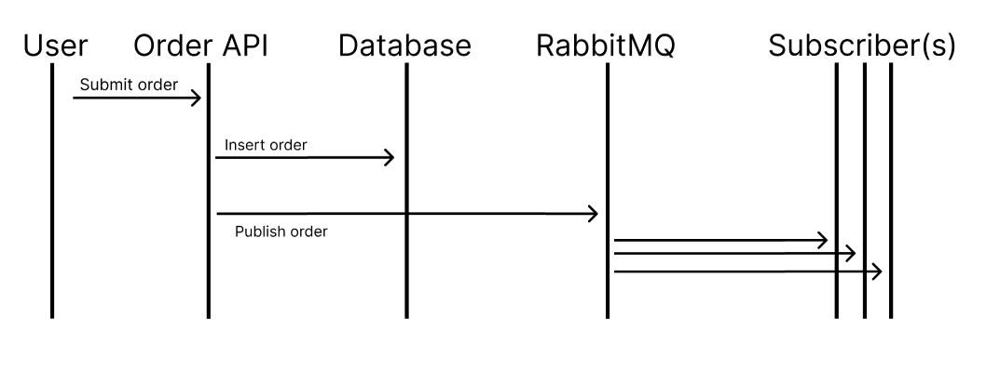
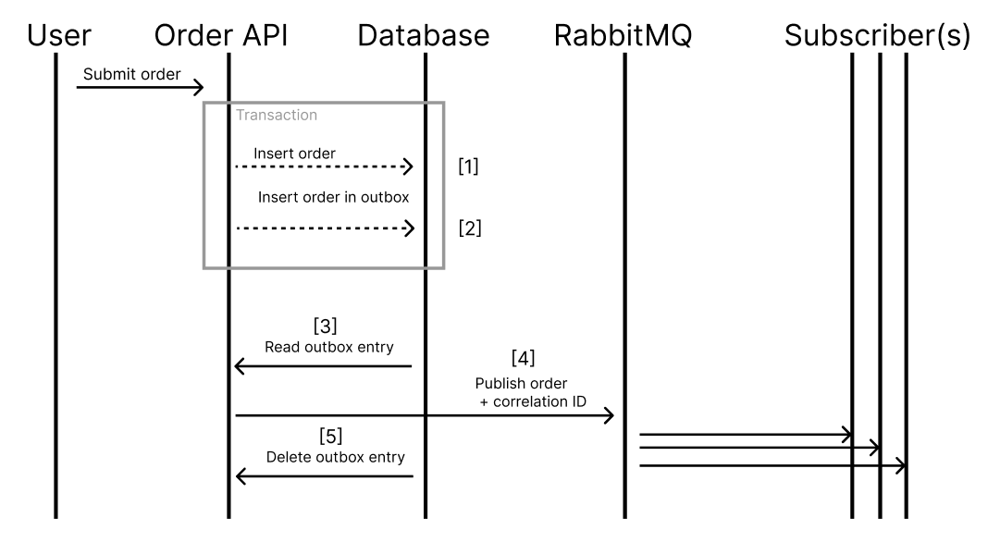

# Order Processor Pipeline
Using microservice outbox pattern to provide reliable and consistent order messaging in a distributed system 

## Simple pipeline

Here is a simple pipeline for storing an order in a database then sending to a message broker for processing. An issue with this pipeline is if the pipeline breaks between inserting into the database and sending to the message broker. If this happens then the order will be recorded in the system but the order will have never made it to the order processor. This leaves the database and message broker in an inconsistent state.

## Consistency Assurance
Using the outbox & correlation identifier patterns, we can ensure consistency and reliability in the distributed system.

This sequence diagram shows the data flow in the pipeline.

**[1]** The order is added to the database.

*Failure case:* If this fails then a failure message is sent to user and transaction is aborted

**[2]** Insert order message to outbox table.

*Failure case:* If the order message fails to insert into outbox then the transaction (including inserting order to database) is aborted

**[3]** The outbox processor in the outbox api watches for outbox messages to process.

*Failure case:* If the outbox processor fails to read the order or crashes then, when it recovers (through automatic means or manual intervention), it can process the backlog of items in the outbox, allowing the system to recover to a consistent state

**[4]** The outbox processor published the order to the message broker

*Failure case:* If this case fails then it will be retriggered by the outbox processor as the it has not been removed from the outbox.

**[5]** The outbox record is deleted from the outbox

*Failure case:* If this fails then the outbox processor will retrigger sending of the order. This can result in the case where the message broker is spammed with orders, which are all processed and leaves the system in an inconsistent state. Here each order is given some form of correlation ID which can correlate orders which may have already been processed. This does leave the burden on the client.
